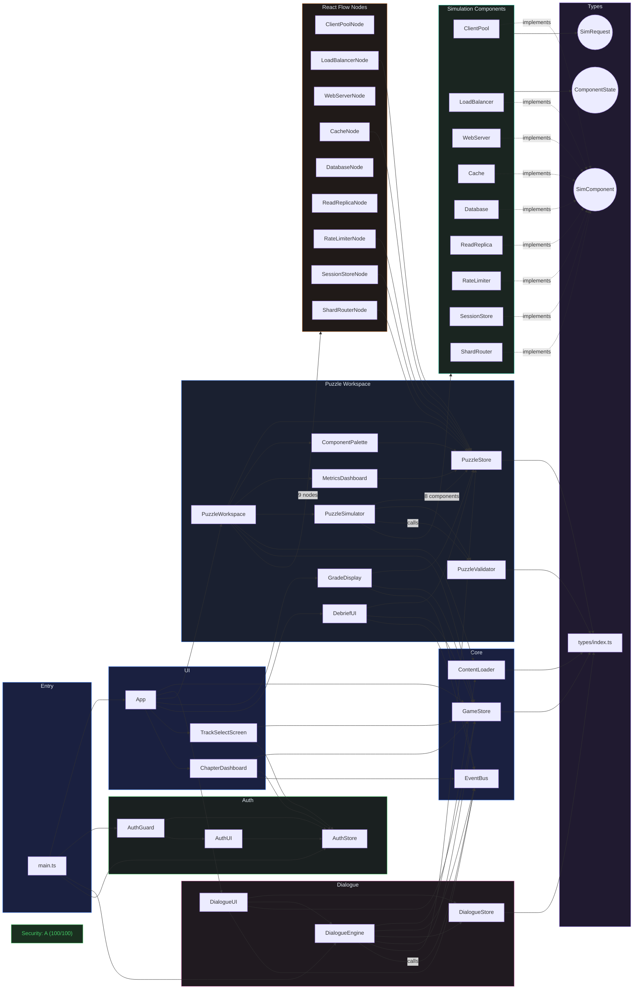

# FrameworkIT - System Design Diagram

- **Project**: system-design-game
- **Path**: `/mnt/c/users/rasha/frameworkit/System Design/system-design-game`
- **Generated**: 2026-03-13
- **Tool**: CMIW (Components, Maps, Interactions, Workflows)

## Legend

| Shape | Meaning |
|-------|---------|
| `["Name"]` rectangle | Class, component, or file |
| `(("Name"))` circle | Interface |
| `-->` solid arrow | Imports |
| `-.->` dashed arrow | Implements |
| `-->\|calls\|` labeled arrow | Function call |
| Collapsed edge `\|"N items"\|` | Multiple edges between clusters |

## Key Metrics

| Metric | Value |
|--------|-------|
| Total components | 109 |
| Total relationships | 99 |
| Clusters | 11 |
| Circular dependencies | 0 |
| Security grade | **A** (100/100) |

### Top 5 Most-Connected Components (Hubs)

| Component | Connections | Role |
|-----------|------------|------|
| PuzzleWorkspace | 16 | Orchestrates puzzle UI, nodes, simulator |
| PuzzleSimulator | 14 | Wires all sim components + validator |
| PuzzleStore | 13 | Central state for puzzle phase |
| types/index.ts | 10 | Shared type definitions |
| GameStore | 9 | Global game state + chapter progression |

### Architecture Summary

- **No circular dependencies** -- clean dependency graph
- **SimComponent interface** is the backbone of the simulation layer, with 9 implementations (one per infrastructure component type)
- **PuzzleSimulator** is the most complex file, importing all 8 simulation components + validator
- **PuzzleStore** is the most depended-on store (13 connections), used by workspace, palette, nodes, simulator, grade display, debrief, and metrics
- **EventBus** decouples the dialogue/chapter flow from the UI layer
